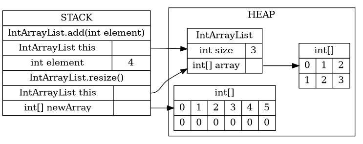

# 9/11 Worksheet: ArrayLists and LinkedLists
## Initial due date: *09/18 @11:59pm*

Collaborators:

Answer the below questions, and make sure that you commit to your own branch.
When done, make a pull request and tag @AnhThuongVo.
Respond to my comments by making new commits to the same branch.

## Review
1. In your own words, explain what an ArrayList is.\
An ArrayList is an array that can change its size, and is built into Java.

2. In your own words, explain what a LinkedList is. How is it different from an ArrayList?\
A LinkedList is a type of array that uses multiple elements with pointers to the next element.  You can find the whole list from just the first element.

## Exploration

1. In this question, you will recreate the Java code to build an ArrayList. The intention is that, after watching the live-coding videos, you should be able to *independently* think through how an ArrayList works, and to write the code from scratch. I encourage you to do this section of the worksheet *without* referring to the videos.

    You can download the starter code in `MyArrayList.java` and work in Eclipse. I recommend using Github Desktop (or commandline git, if you're comfortable with it) to make updating your repo easier.

    Remember to test and save often. The `main()` in `MyArrayList.java` already has some tests, although you will not pass all of them in this section (resizing the list is left for the Challenge section below). 
a. First, we need to be able to create an MyArrayList. Find the public constructor method. What member variables will it need to set? Add those member variables at the first `FIXME`, above the method declaration.    
_Note_: Java does not allow us to instantiate generic arrays. We can get around this by creating an `Object` array and [casting](https://www.geeksforgeeks.org/class-type-casting-in-java/) it to the generic type. For example: `T[] arr = (T[]) new Object [len];`\
The member variables it needs to set are `T[] array` to a new array of length initialLength and `int size` to 0
b. Fill in the missing code inside the constructor, making sure to set the member variables you just added.  
c. This is an easy one - we should be able to quickly check the current size of our MyArrayList. Fix the `size()` method to return the current actual size.  
d. Now that we can create an MyArrayList and check its size, let's start putting elements in there. Fill in the `add()` method, which adds a given element to the end of an MyArrayList. You do *not* need to worry about resizing for now; that is left for the Challenge section below.  
e. Once we have put a few variables inside our MyArrayList, we should be able view them. Fix the` get()` method, which takes an index and returns the element that is at index in the MyArrayList.

2. In this question, you will recreate the Java code to build a LinkedList. The intention is that, after watching the live-coding videos, you should be able to *independently* think through how a LinkedList works, and to write the code from scratch. I encourage you to do this section of the worksheet *without* referring to the videos.

    You can download the starter code in `MyLinkedList.java` and work in Eclipse. I recommend using Github Desktop (or commandline git, if you're comfortable with it) to make updating your repo easier.        
a. First, we need to create the inner Node class. What member variables does it need? What information is stored in each of these member variables? Write the code for these member variables, and initialize them in the Node constructor.\
Member variables:\
    `Node next` - the next element in the linked list\
    `T data` - the element stored in the Node\
b. What are the member variables of the MyLinkedList class? What information is stored in each of these member variables? What should they be initialized to? Write the code for these member variables, and initialize them in the MyLinkedList constructor. Consider where the `head` and `tail` pointers, in particular, should point.\
`Node head` - the first element, initialized to null, `Node tail` - the last element, initialized to null, `int size`, the size of the linked list, initialized to 0
c. Another easy one - fill out the code for `size()`, which should return the current number of elements in our MyLinkedList.  
d. For a singly-linked list, there are two cases we have to think about for `add()`. What are those cases? What should be done in each case? Write the code for `add()` when you understand what should happen in each case.\
Both cases: `size` is incremented\
The case where there is no elements in the linked list: `head` and `tail` are both set to a Node with the new element\
The case where there is an element: the current tail has its `next` field set to a Node with the new element, that Node then becomes the new tail\
e. The next method, `get()` requires looping through the nodes to get to the correct index. Fill in the code for `get()`.  

## Challenge

1. To complete our ArrayList implementation, we need to add two more methods: `remove()` and `resize()`.    
a. Implement the `remove()` method, which removes the element at a given index in an MyArrayList.  
b. The `resize()` method is a bit more complicated. The memory diagrams, below, show what we want to happen step-by-step. Implement the `resize()` method, referring to the diagrams. Note that this is a private method that does not take any arguments and does not return anything.

    
    
    
  
    c. Finally, update your `add()` method to make use of `resize()`. Your implementation of MyArrayList is now complete.

3. To complete our MyLinkedList implementation, we only need to add one method: `remove()`.    
a. Why do we _not_ need a `resize()` method for MyLinkedList?\
It is not stored in an array, instead, pointers are updated when an element is added. No new memory for an array needs to be allocated because elements can be stored anywhere in memory.
b. The code for the `remove()` method can be broken down into four cases. What are they? What should the code do in each case?\
All cases: decrement size
Removing first and only element: set head & tail to null\
Removing first of multiple elements: set head to next element\
Removing last element: set tail to previous element, set tail.next to null\
Removing element in middle: set previous element.next to next element (skipping removed)\
c. Write the code for `remove()`.  Your implementation of MyLinkedList is now complete.

4. Sections 4.6-4.8 of Zybooks describe a data structure called the doubly-linked list. in short, the main distinguishing feature of a doubly-linked list is that nodes have both `next` and `prev` pointers, that point to the next node and the previous node respectively. This means that the code for a doubly-linked list is almost exactly the same as that for a singly-linked lists, except for the node pointers that you have to change when adding and removing elements.    
a. Without writing any code, explain how you would need to modify your MyLinkedList `add()` method to turn your implementation into a doubly-linked list.\
Set prev of added element to the previous tail
b. Without writing any code, explain how you would need to modify your MyLinkedList `remove()` method to turn your implementation into a doubly-linked list. How would each of the four cases change?\
For each case, the following must be added:\
Removing first and only element: nothing\
Removing first of multiple elements: set prev on the new first element to null\
Removing last element: nothing\
Removing element in middle: set prev on next element to previous element
